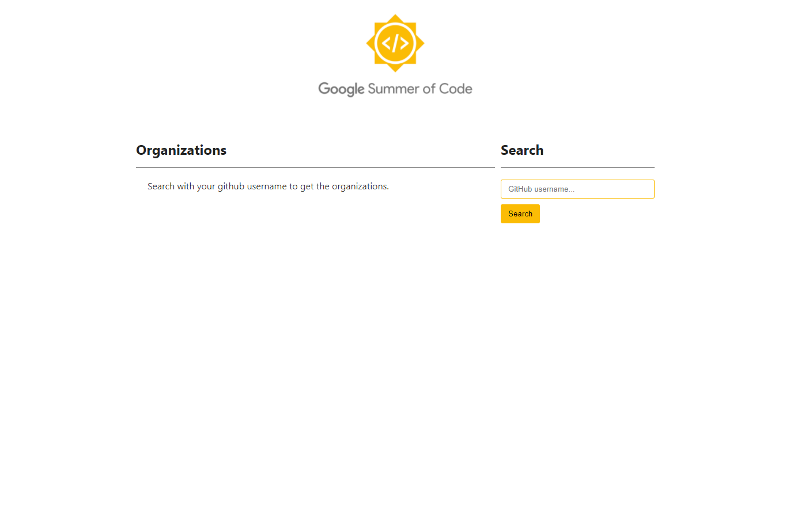
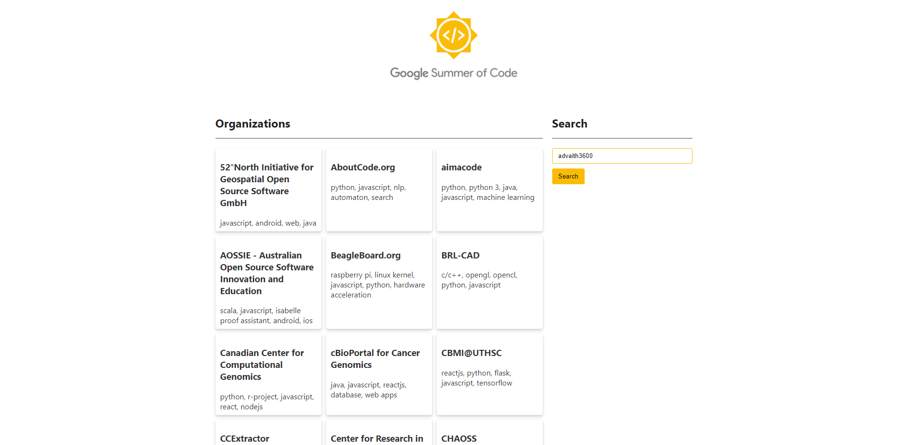

# GSoC OrgFinder

An application that helps in searching organizations to contribute to easily

## Tech Stack used
### Frontend
- React
- Java Script
### Backend
- django
- python

## About the project
- We know that there will be so many organisations participating in GSoC. Students usually get confused about which organisation to choose. To solve that we came with an idea called OrgFinder.

- OrgFinder is a web application that suggests the hitlist of GSoC projects for a member based on what he knows. 

## How we Approached the idea of the project

- The user has to enter their GitHub username in the search box.

- The GitHub API will search for the username and will fetch the programming languages with which the user is familiar.

- The familiar languages are searched in a CSV file obtained by web-scraping and then returns matching organizations and their details in a JSON format so that they can be displayed out on the website. 

## Frontend

The interface of the application

The interface is built using React. The user has to enter the username of their GitHub account and then click on the search button. 

## Why OrgFinder?
- It is easy to use as the input required is just your GitHub username.

- For most Open-Source enthusiasts, GitHub tends to be the proof of their knowledge in the field, hence using its API gives relevant and organisations that attract the user's interests.  

- Searching in the pool of 100's of organisations to choose a maximum of 3 manually and reading about each of them may end up being vain while our **OrgFinder** suggests you a list of the organisations according to your knowledge, hence, saving your valuable time.

## Result

The crisp and concise UI our OrgFinder displays showing all the relevent data a participant should see at the first glance.
